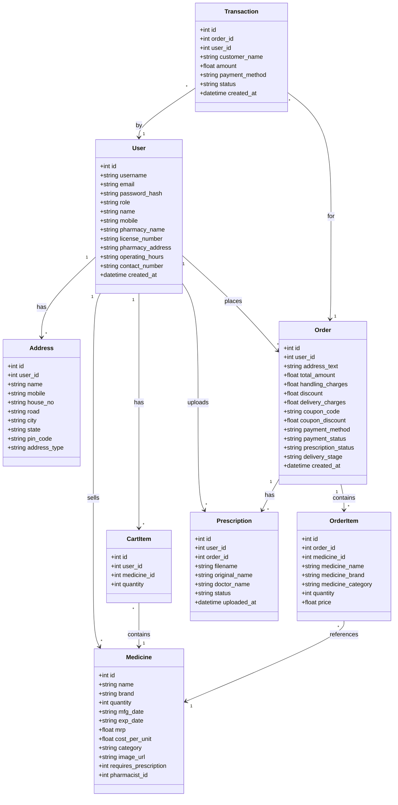

# Class Diagram

Paste the code below into https://mermaid.live to render.

```mermaid
classDiagram
    class User {
        +int id
        +string username
        +string email
        +string password_hash
        +string role
        +string name
        +string mobile
        +string pharmacy_name
        +string license_number
        +string pharmacy_address
        +string operating_hours
        +string contact_number
        +datetime created_at
    }

    class Address {
        +int id
        +int user_id
        +string name
        +string mobile
        +string house_no
        +string road
        +string city
        +string state
        +string pin_code
        +string address_type
    }

    class Medicine {
        +int id
        +string name
        +string brand
        +int quantity
        +string mfg_date
        +string exp_date
        +float mrp
        +float cost_per_unit
        +string category
        +string image_url
        +int requires_prescription
        +int pharmacist_id
    }

    class CartItem {
        +int id
        +int user_id
        +int medicine_id
        +int quantity
    }

    class Order {
        +int id
        +int user_id
        +string address_text
        +float total_amount
        +float handling_charges
        +float discount
        +float delivery_charges
        +string coupon_code
        +float coupon_discount
        +string payment_method
        +string payment_status
        +string prescription_status
        +string delivery_stage
        +datetime created_at
    }

    class OrderItem {
        +int id
        +int order_id
        +int medicine_id
        +string medicine_name
        +string medicine_brand
        +string medicine_category
        +int quantity
        +float price
    }

    class Prescription {
        +int id
        +int user_id
        +int order_id
        +string filename
        +string original_name
        +string doctor_name
        +string status
        +datetime uploaded_at
    }

    class Transaction {
        +int id
        +int order_id
        +int user_id
        +string customer_name
        +float amount
        +string payment_method
        +string status
        +datetime created_at
    }

    User "1" --> "*" Address : has
    User "1" --> "*" CartItem : has
    User "1" --> "*" Order : places
    User "1" --> "*" Prescription : uploads
    User "1" --> "*" Medicine : sells
    CartItem "*" --> "1" Medicine : contains
    Order "1" --> "*" OrderItem : contains
    Order "1" --> "*" Prescription : has
    OrderItem "*" --> "1" Medicine : references
    Transaction "*" --> "1" Order : for
    Transaction "*" --> "1" User : by
```
