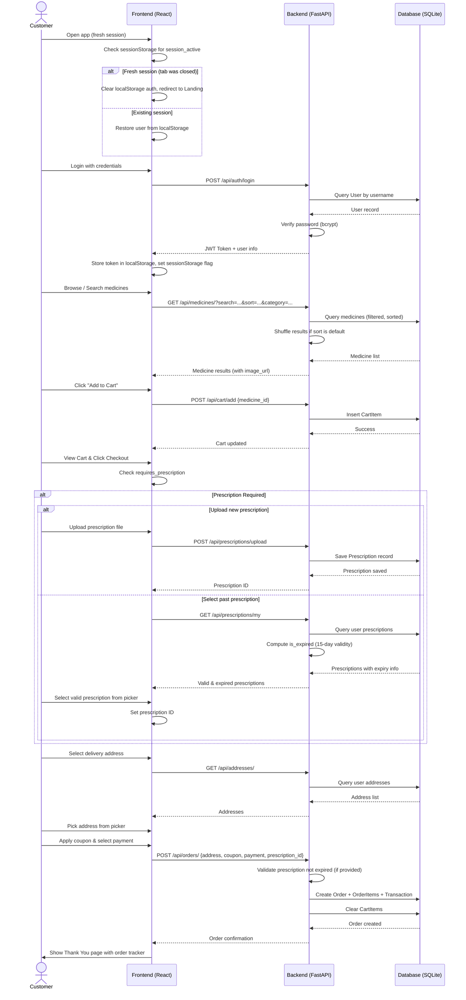

# Sequence Diagram — Order Placement Flow

Paste the code below into https://mermaid.live to render.

```mermaid
sequenceDiagram
    actor C as Customer
    participant FE as Frontend (React)
    participant BE as Backend (FastAPI)
    participant DB as Database (SQLite)

    C->>FE: Open app (fresh session)
    FE->>FE: Check sessionStorage for session_active
    alt Fresh session (tab was closed)
        FE->>FE: Clear localStorage auth, redirect to Landing
    else Existing session
        FE->>FE: Restore user from localStorage
    end

    C->>FE: Login with credentials
    FE->>BE: POST /api/auth/login
    BE->>DB: Query User by username
    DB-->>BE: User record
    BE->>BE: Verify password (bcrypt)
    BE-->>FE: JWT Token + user info
    FE->>FE: Store token in localStorage, set sessionStorage flag

    C->>FE: Browse / Search medicines
    FE->>BE: GET /api/medicines/?search=...&sort=...&category=...
    BE->>DB: Query medicines (filtered, sorted)
    BE->>BE: Shuffle results if sort is default
    DB-->>BE: Medicine list
    BE-->>FE: Medicine results (with image_url)

    C->>FE: Click "Add to Cart"
    FE->>BE: POST /api/cart/add {medicine_id}
    BE->>DB: Insert CartItem
    DB-->>BE: Success
    BE-->>FE: Cart updated

    C->>FE: View Cart & Click Checkout
    FE->>FE: Check requires_prescription

    alt Prescription Required
        alt Upload new prescription
            C->>FE: Upload prescription file
            FE->>BE: POST /api/prescriptions/upload
            BE->>DB: Save Prescription record
            DB-->>BE: Prescription saved
            BE-->>FE: Prescription ID
        else Select past prescription
            FE->>BE: GET /api/prescriptions/my
            BE->>DB: Query user prescriptions
            BE->>BE: Compute is_expired (15-day validity)
            DB-->>BE: Prescriptions with expiry info
            BE-->>FE: Valid & expired prescriptions
            C->>FE: Select valid prescription from picker
            FE->>FE: Set prescription ID
        end
    end

    C->>FE: Select delivery address
    FE->>BE: GET /api/addresses/
    BE->>DB: Query user addresses
    DB-->>BE: Address list
    BE-->>FE: Addresses
    C->>FE: Pick address from picker

    C->>FE: Apply coupon & select payment
    FE->>BE: POST /api/orders/ {address, coupon, payment, prescription_id}
    BE->>BE: Validate prescription not expired (if provided)
    BE->>DB: Create Order + OrderItems + Transaction
    BE->>DB: Clear CartItems
    DB-->>BE: Order created
    BE-->>FE: Order confirmation

    FE->>C: Show Thank You page with order tracker
```
