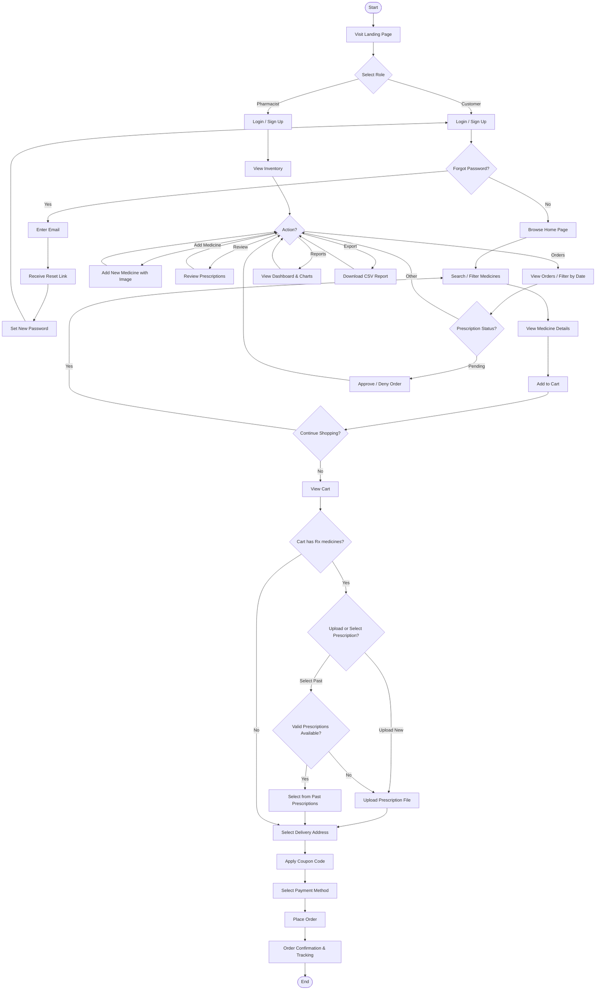

# Activity Diagram — Customer Order Flow

Paste the code below into https://mermaid.live to render.

```mermaid
flowchart TD
    A([Start]) --> B[Visit Landing Page]
    B --> C{Select Role}
    C -->|Customer| D[Login / Sign Up]
    C -->|Pharmacist| P[Login / Sign Up]

    D --> D1{Forgot Password?}
    D1 -->|Yes| D2[Enter Email]
    D2 --> D3[Receive Reset Link]
    D3 --> D4[Set New Password]
    D4 --> D
    D1 -->|No| E[Browse Home Page]

    E --> F[Search / Filter Medicines]
    F --> G[View Medicine Details]
    G --> H[Add to Cart]
    H --> I{Continue Shopping?}
    I -->|Yes| F
    I -->|No| J[View Cart]
    J --> K{Cart has Rx medicines?}
    K -->|Yes| L{Upload or Select Prescription?}
    L -->|Upload New| L1[Upload Prescription File]
    L -->|Select Past| L2{Valid Prescriptions Available?}
    L2 -->|Yes| L3[Select from Past Prescriptions]
    L2 -->|No| L1
    L1 --> M[Select Delivery Address]
    L3 --> M
    K -->|No| M
    M --> N[Apply Coupon Code]
    N --> O[Select Payment Method]
    O --> Q[Place Order]
    Q --> R[Order Confirmation & Tracking]
    R --> S([End])

    P --> T[View Inventory]
    T --> U{Action?}
    U -->|Add Medicine| V[Add New Medicine with Image]
    U -->|Review| W[Review Prescriptions]
    U -->|Orders| X[View Orders / Filter by Date]
    X --> X1{Prescription Status?}
    X1 -->|Pending| X2[Approve / Deny Order]
    X1 -->|Other| U
    X2 --> U
    U -->|Reports| Y[View Dashboard & Charts]
    U -->|Export| Z[Download CSV Report]
    V --> U
    W --> U
    Y --> U
    Z --> U
```
