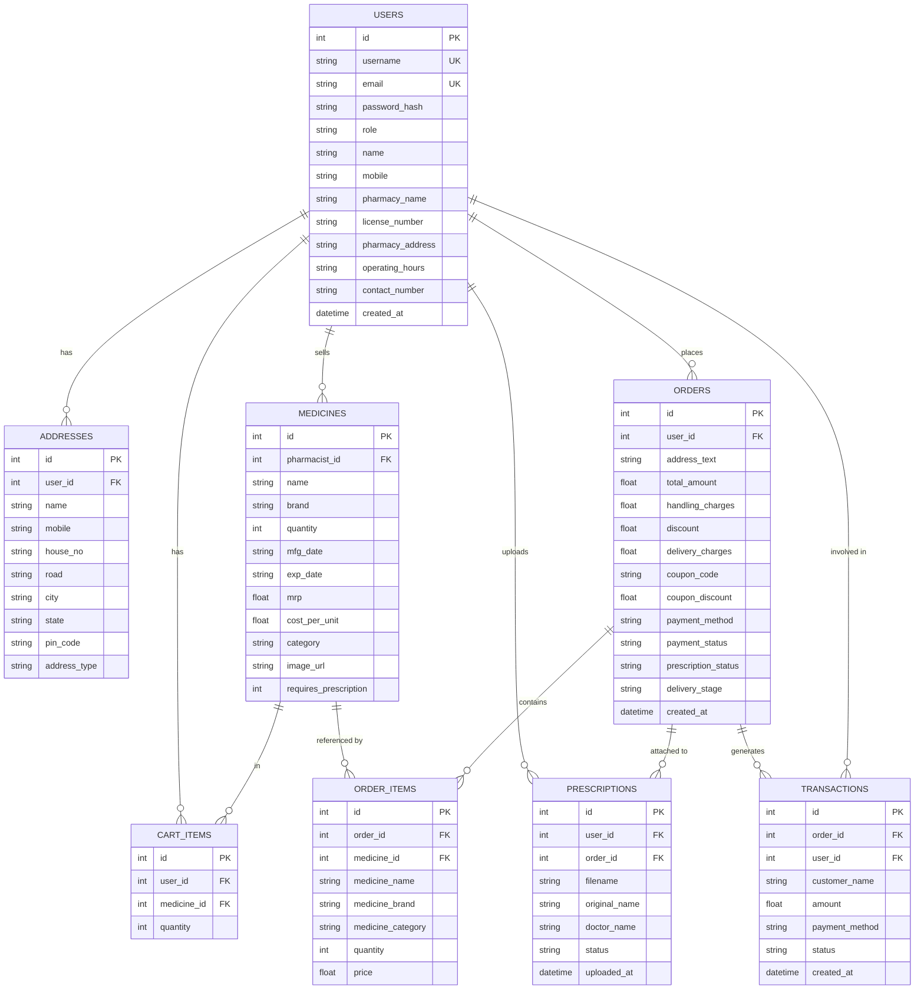

# ER Diagram — Database Schema

Paste the code below into https://mermaid.live to render.

```mermaid
erDiagram
    USERS {
        int id PK
        string username UK
        string email UK
        string password_hash
        string role
        string name
        string mobile
        string pharmacy_name
        string license_number
        string pharmacy_address
        string operating_hours
        string contact_number
        datetime created_at
    }

    ADDRESSES {
        int id PK
        int user_id FK
        string name
        string mobile
        string house_no
        string road
        string city
        string state
        string pin_code
        string address_type
    }

    MEDICINES {
        int id PK
        int pharmacist_id FK
        string name
        string brand
        int quantity
        string mfg_date
        string exp_date
        float mrp
        float cost_per_unit
        string category
        string image_url
        int requires_prescription
    }

    CART_ITEMS {
        int id PK
        int user_id FK
        int medicine_id FK
        int quantity
    }

    ORDERS {
        int id PK
        int user_id FK
        string address_text
        float total_amount
        float handling_charges
        float discount
        float delivery_charges
        string coupon_code
        float coupon_discount
        string payment_method
        string payment_status
        string prescription_status
        string delivery_stage
        datetime created_at
    }

    ORDER_ITEMS {
        int id PK
        int order_id FK
        int medicine_id FK
        string medicine_name
        string medicine_brand
        string medicine_category
        int quantity
        float price
    }

    PRESCRIPTIONS {
        int id PK
        int user_id FK
        int order_id FK
        string filename
        string original_name
        string doctor_name
        string status
        datetime uploaded_at
    }

    TRANSACTIONS {
        int id PK
        int order_id FK
        int user_id FK
        string customer_name
        float amount
        string payment_method
        string status
        datetime created_at
    }

    USERS ||--o{ ADDRESSES : "has"
    USERS ||--o{ CART_ITEMS : "has"
    USERS ||--o{ ORDERS : "places"
    USERS ||--o{ PRESCRIPTIONS : "uploads"
    USERS ||--o{ MEDICINES : "sells"
    MEDICINES ||--o{ CART_ITEMS : "in"
    MEDICINES ||--o{ ORDER_ITEMS : "referenced by"
    ORDERS ||--o{ ORDER_ITEMS : "contains"
    ORDERS ||--o{ PRESCRIPTIONS : "attached to"
    ORDERS ||--o{ TRANSACTIONS : "generates"
    USERS ||--o{ TRANSACTIONS : "involved in"
```
